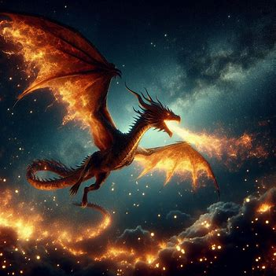
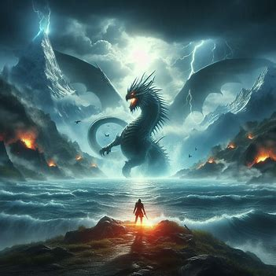
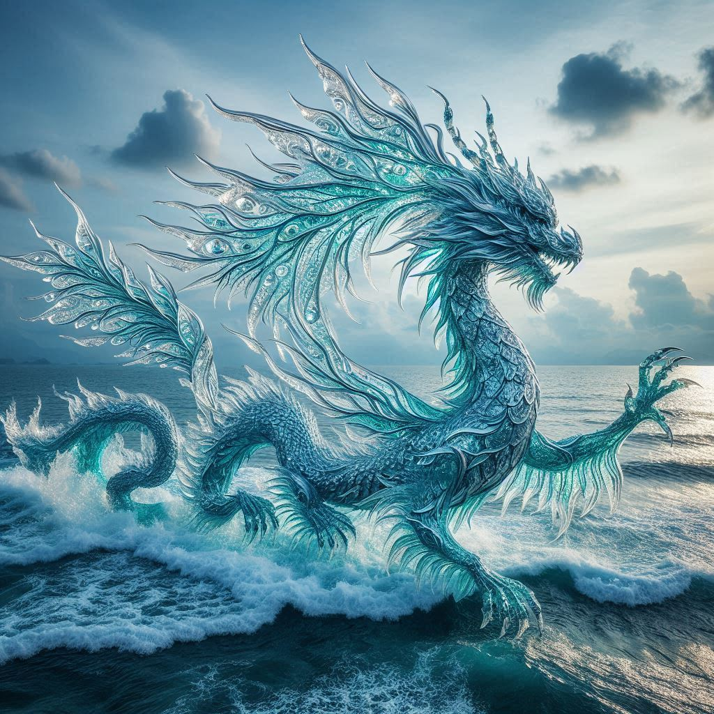

## 📒 Descrição
A ideia é criar um sistema capaz de gerar imagens artísticas com base em descrições textuais fornecidas pelos usuários. Isso será feito utilizando Modelos de IA Generativa, que são treinados para transformar texto em imagens. Esses modelos capturam padrões e estilos artísticos a partir de um vasto conjunto de dados e aplicam isso na geração de novas obras de arte.

## 🤖 Tecnologias Utilizadas
DALL-E,BING, CHATGPT

## 🧐 Processo de Criação
O processo de criação para um Gerador de Arte Digital com IA envolve a definição clara do projeto, a escolha e integração de uma plataforma de IA generativa, o desenvolvimento de uma interface amigável para os usuários, testes rigorosos para garantir a qualidade e o lançamento da ferramenta. Esse projeto permite que qualquer pessoa crie arte digital de maneira fácil e acessível, aproveitando o poder da inteligência artificial.

## 🚀 Resultados
,,

## iMAGENS GERADAS PELAS IA 

